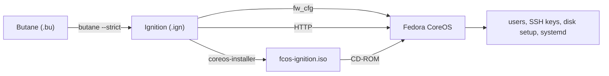
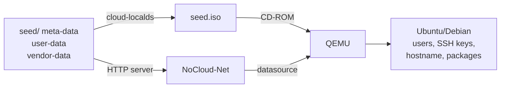
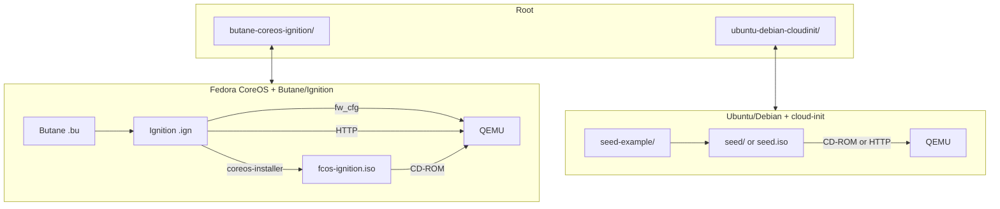

# Linux Initial Boot Provisioning

Experiments for provisioning Linux VMs with **QEMU** using either **Fedora CoreOS + Butane/Ignition** or **Ubuntu/Debian + cloud-init**.

## Why This Experiment

System administrators and DevOps engineers need to provision VMs consistently, repeatably, and at scale. This repository explores two fundamentally different approaches to that problem — **infrastructure-as-code at the OS level** vs **configuration management at the runtime level** — so you can understand the differences and decide which fits your workflow.

### Who Is This For

- **System Administrators** — Learn how to automate VM setup from scratch without manually clicking through installers
- **DevOps Engineers** — Understand how to bake OS configuration into images or apply it at boot time
- **Platform Engineers** — Compare immutable infrastructure patterns vs mutable configuration management
- **Anyone** — Curious about how cloud-init and Ignition work under the hood

### Learning Goals

1. **Understand the difference** between declarative OS provisioning (Ignition) and runtime configuration (cloud-init)
2. **Learn to implement** both methods from scratch using QEMU as the virtualization layer
3. **Compare** when to use immutable infrastructure vs mutable configuration
4. **Experience** the full lifecycle — download image, configure, provision, verify, reset

## Project Structure

```text
.
├── README.md                          # This file
├── .gitignore                         # Ignores generated artifacts
├── butane-coreos-ignition/            # Fedora CoreOS provisioning with Butane & Ignition
│   ├── README.md
│   ├── *.bu.example                   # Butane configuration templates
│   └── ...
└── ubuntu-debian-cloudinit/           # Ubuntu/Debian provisioning with cloud-init
    ├── README.md
    ├── seed-example/                  # Cloud-init seed templates
    └── ...
```

## Quick Start

| Method | OS | Provisioning Tool | README |
| --- | --- | --- | --- |
| **Ignition** | Fedora CoreOS | Butane → Ignition | [`butane-coreos-ignition/README.md`](butane-coreos-ignition/README.md) |
| **Cloud-Init** | Ubuntu / Debian | cloud-init + NoCloud | [`ubuntu-debian-cloudinit/README.md`](ubuntu-debian-cloudinit/README.md) |

## Use Cases

### Ignition (Fedora CoreOS)

Ideal for **immutable, declarative infrastructure**. Define the entire system state in a Butane config, convert to Ignition, and the OS applies it on first boot. Supports three delivery methods: `fw_cfg`, HTTP, or embedded ISO via `coreos-installer`. Best for container-heavy workloads, Kubernetes nodes, and repeatable VM templates.



### Cloud-Init (Ubuntu/Debian)

Ideal for **traditional server provisioning**. Seed a cloud image with users, SSH keys, and runtime config via NoCloud ISO or NoCloud-Net. Best for general-purpose VMs, dev environments, and ad-hoc testing.



### Architecture Overview



### Three Methods Compared

| Method | Fedora CoreOS | Ubuntu/Debian |
| --- | --- | --- |
| **fw_cfg** | `qemu -fw_cfg file=root.ign` | N/A |
| **HTTP** | `py -m http.server` + `bootstrap.bu` | `python -m http.server` + `seed/` |
| **ISO/CD-ROM** | `coreos-installer iso ignition embed` | `cloud-localds seed.iso` |

## .example Files

Each subfolder contains `.example` template files or a `seed-example/` directory. **You must create a copy before editing.** See the per-folder README for instructions.

## .gitignore

This repository uses `.gitignore` to exclude generated and sensitive artifacts from version control. The following file types and directories are **ignored** and should **not** be committed:

| Pattern | Reason |
| --- | --- |
| `*.qcow2` | QEMU disk images (large, binary) |
| `*.img` | Disk images (large, binary) |
| `*.iso` | ISO images (large, binary) |
| `*.ign` | Generated Ignition configs |
| `*.bu` | Generated Butane configs |
| `*.log` | QEMU log files |
| `seed/` | Active cloud-init seed directory |

**Only template/example files and source configurations should be tracked by Git.** Always copy `.example` files before modifying them.

## Prerequisites

- [QEMU](https://www.qemu.org/)
- [Butane](https://coreos.github.io/butane/) (for Fedora CoreOS)
- [cloud-localds](https://cloudinit.readthedocs.io/) (for Ubuntu/Debian, to generate `seed.iso`)
- OpenSSL (for generating password hashes)

## References

- [Fedora CoreOS](https://fedoraproject.org/coreos/)
- [Butane](https://coreos.github.io/butane/)
- [cloud-init](https://cloudinit.readthedocs.io/)
