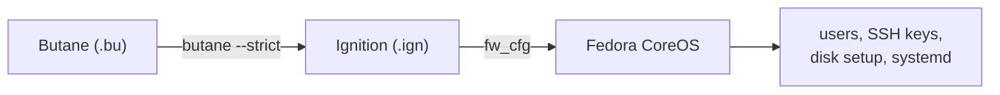
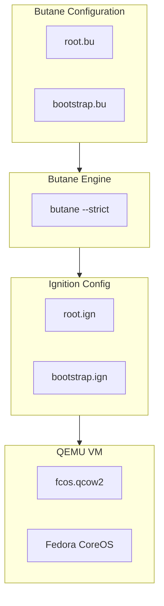
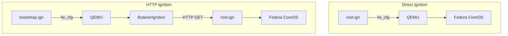
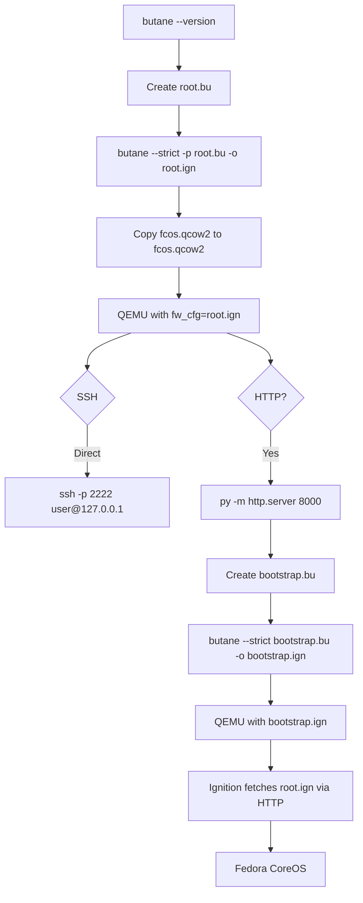

# Fedora CoreOS Provisioning with QEMU

This guide covers provisioning Fedora CoreOS VMs using **Butane** to generate **Ignition** configuration files, served via QEMU.

### Why Use This Approach

Fedora CoreOS is designed for **immutable infrastructure**. Once deployed, the OS does not change — every configuration is declared before boot and applied once. This eliminates configuration drift and makes every instance identical. DevOps teams running Kubernetes clusters, container runtimes, or any fleet of identical machines prefer this model because it is predictable, version-controlled, and easily reproduced.

**Key concepts:**
- **Butane** is a human-readable configuration language that compiles to Ignition JSON
- **Ignition** runs only on first boot and applies the entire system state (users, disks, systemd units, network)
- After provisioning, the system is **immutable** — changes are made by rebuilding the config, not by editing the running system

### Use Case

Ideal for **immutable, declarative infrastructure**. Define the entire system state in a Butane config, convert to Ignition, and the OS applies it on first boot. Best for container-heavy workloads, Kubernetes nodes, and repeatable VM templates.



### Architecture



### Direct vs HTTP Ignition Flow



### Full Workflow



## .example Files

This folder contains `.example` template files. **You must create a copy of each `.example` file before editing it.** Do not edit `.example` files directly.

```powershell
Copy-Item .\bootstrap.bu.example .\bootstrap.bu
Copy-Item .\example.bu.example .\root.bu
```

```bash
cp bootstrap.bu.example bootstrap.bu
cp example.bu.example root.bu
```

After copying, edit the `.bu` files with your actual values (password hashes, SSH keys, hostnames, etc.).

- `bootstrap.bu.example` → Copy to `bootstrap.bu` (HTTP Ignition bootstrap config)
- `example.bu.example` → Copy to `root.bu` (Main Butane user config)

## .gitignore

The following generated files are **ignored** by `.gitignore` and should **not** be committed:

| Pattern | Reason |
| --- | --- |
| `*.qcow2` | QEMU disk images |
| `*.ign` | Generated Ignition configs |
| `*.bu` | Generated Butane configs |
| `*.log` | QEMU log files |

Only `.example` files and source configurations should be tracked by Git.

## Steps

### 1. Download Fedora CoreOS

Download from:

```text
https://fedoraproject.org/coreos/download/?arch=x86_64#download_section
```

Select:

```text
x86_64
Bare Metal & Virtualized
Virtualized
QEMU / qcow2
```

Download the `.qcow2.xz` file and extract it.

Example:

```text
fedora-coreos-bootstrap.qcow2
```

---

### 2. Create a VM Copy

Keep the original image as backup.

```powershell
Copy-Item .\fedora-coreos-bootstrap.qcow2 .\fcos.qcow2
```

```bash
cp fedora-coreos-bootstrap.qcow2 fcos.qcow2
```

Files:

```text
fedora-coreos-bootstrap.qcow2    # Backup
fcos.qcow2                       # VM
```

---

### 3. Install Butane

Butane converts `.bu` files to `.ign` files.

```text
https://coreos.github.io/butane/
```

Verify:

```bash
butane --version
```

---

### 4. Create Butane Configuration

Create:

```text
root.bu
```

Example:

```yaml
variant: fcos
version: 1.6.0

passwd:
  users:
    - name: root
      password_hash: "$6$<password-hash>"
      groups:
        - wheel

    - name: admin
      groups:
        - wheel
      ssh_authorized_keys:
        - ssh-ed25519 AAAAC3NzaC1lZDI1NTE5AAAAIBe6cjjsNkIqts1b4GNOC5DhwPsy17OvHnzY79DhzFGw mark wayne@ragnarok
```

Generate a password hash:

```bash
openssl passwd -6 '<password>'
```

---

### 5. Generate Ignition File

```powershell
butane --strict -p .\root.bu --output .\root.ign
```

```bash
butane --strict -p ./root.bu --output ./root.ign
```

Result:

```text
root.bu
root.ign
```

---

### 6. Run QEMU

```powershell
qemu-system-x86_64 `
  -m 4096 `
  -smp 2 `
  -drive file=.\fcos.qcow2,format=qcow2 `
  -fw_cfg name=opt/com.coreos/config,file=.\root.ign `
  -nic user,model=virtio-net-pci
```

or

```bash
qemu-system-x86_64 `
  -m 4096 `
  -smp 2 `
  -drive file=.\fcos.qcow2,format=qcow2 `
  -fw_cfg name=opt/com.coreos/config,file=.\root.ign `
  -nic user,model=virtio-net-pci,hostfwd=tcp::2222-:22
```

then you can connect:

```bash
ssh -p 2222 marcuwynu23@127.0.0.1
```

if already in a known_hosts then do this:

```bash
ssh-keygen -R "[127.0.0.1]:2222"
```

---

### 7. HTTP Ignition

Create:

```text
bootstrap.bu
```

```yaml
variant: fcos
version: 1.6.0

ignition:
  config:
    replace:
      source: http://10.126.90.210:8000/root.ign
```

Generate:

```powershell
butane --strict .\bootstrap.bu --output .\bootstrap.ign
```

```bash
butane --strict ./bootstrap.bu --output ./bootstrap.ign
```

---

### 8. Serve Ignition

From the directory containing `root.ign`:

```powershell
py -m http.server 8000 --bind 0.0.0.0
```

```bash
python -m http.server 8000 --bind 0.0.0.0
```

Test:

```bash
curl http://10.126.90.210:8000/root.ign
```

---

### 9. Run QEMU with HTTP Ignition

```powershell
qemu-system-x86_64 `
  -m 4096 `
  -smp 2 `
  -drive file=.\fcos.qcow2,format=qcow2 `
  -fw_cfg name=opt/com.coreos/config,file=.\bootstrap.ign `
  -nic user,model=virtio-net-pci
```

```bash
qemu-system-x86_64 \
  -m 4096 \
  -smp 2 \
  -drive file=./fcos.qcow2,format=qcow2 \
  -fw_cfg name=opt/com.coreos/config,file=./bootstrap.ign \
  -nic user,model=virtio-net-pci
```

Flow:


---

### 10. Verify Ignition

```bash
systemctl status ignition-firstboot-complete.service
```

```bash
journalctl -b | grep -i ignition
```

Check users:

```bash
getent passwd root
getent passwd admin
```

---

### 11. Reset VM

Delete the working disk:

```powershell
Remove-Item .\fcos.qcow2
```

```bash
rm fcos.qcow2
```

Create a new copy:

```powershell
Copy-Item .\fedora-coreos-bootstrap.qcow2 .\fcos.qcow2
```

```bash
cp fedora-coreos-bootstrap.qcow2 fcos.qcow2
```

---

### 12. Optional QEMU Logs

```powershell
qemu-system-x86_64 `
  -m 4096 `
  -smp 2 `
  -drive file=.\fcos.qcow2,format=qcow2 `
  -fw_cfg name=opt/com.coreos/config,file=.\bootstrap.ign `
  -nic user,model=virtio-net-pci `
  -d guest_errors `
  -D qemu.log
```

```bash
qemu-system-x86_64 \
  -m 4096 \
  -smp 2 \
  -drive file=./fcos.qcow2,format=qcow2 \
  -fw_cfg name=opt/com.coreos/config,file=./bootstrap.ign \
  -nic user,model=virtio-net-pci \
  -d guest_errors \
  -D qemu.log
```

View:

```powershell
Get-Content .\qemu.log
```

```bash
cat qemu.log
```

Ignition logs:

```bash
journalctl -b | grep -i ignition
```

## References

```text
https://fedoraproject.org/coreos/
https://fedoraproject.org/coreos/download/
https://coreos.github.io/butane/
```
