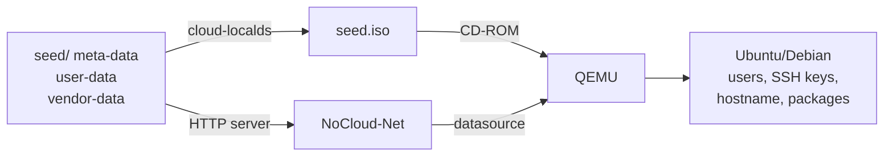
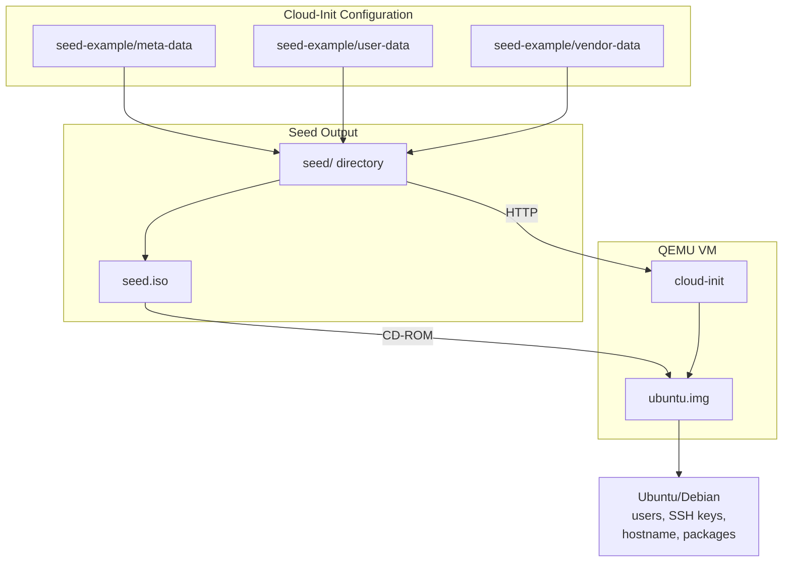
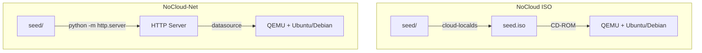
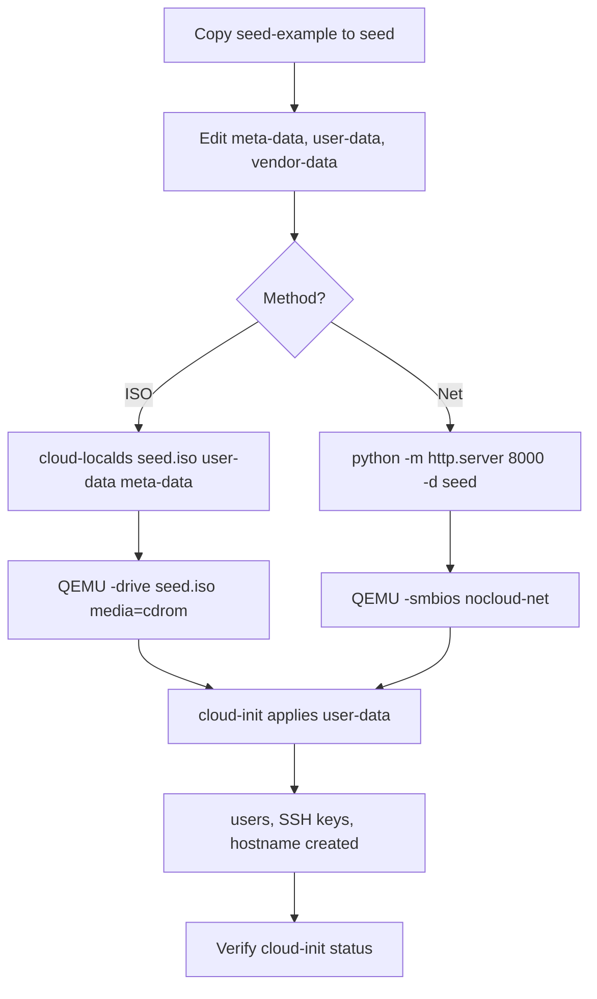
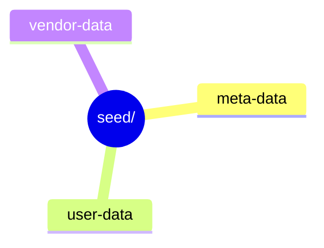
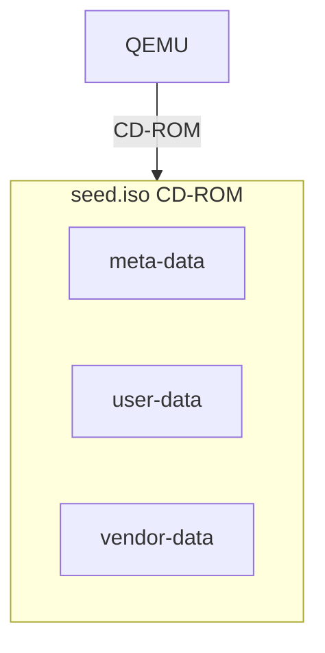
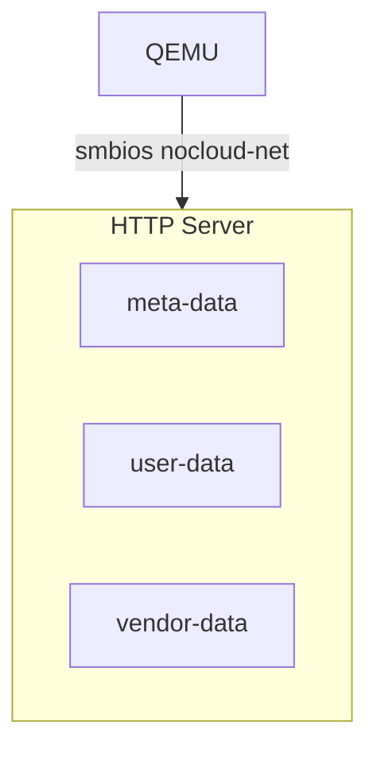

# Cloud-Init Provisioning with QEMU

This guide covers provisioning Ubuntu/Debian VMs using **cloud-init** with QEMU, using either a NoCloud ISO or NoCloud-Net datasource.

### Why Use This Approach

Cloud-init is the **de facto standard** for initial cloud VM configuration. Unlike Ignition, it runs at every boot and can reconfigure the system over time. This makes it ideal for general-purpose servers, development environments, and any scenario where you need flexibility to change configuration after deployment. System administrators and DevOps engineers who manage fleets of diverse machines, need ad-hoc provisioning, or rely on existing cloud-native tooling use cloud-init daily.

**Key concepts:**
- **cloud-init** runs on first boot and can run again on subsequent boots
- **NoCloud** datasources allow you to feed configuration via ISO or HTTP without internet access
- The system is **mutable** — you can change users, packages, and config after deployment

### Use Case

Ideal for **traditional server provisioning**. Seed a cloud image with users, SSH keys, and runtime config via NoCloud ISO or NoCloud-Net. Best for general-purpose VMs, dev environments, and ad-hoc testing.



### Architecture



### NoCloud ISO vs NoCloud-Net



### Full Workflow



## .example Files & seed-example

This folder contains a `seed-example/` directory as a template. **You must create a copy of `seed-example` before editing it.** Do not edit files inside `seed-example/` directly.

```powershell
Copy-Item -Recurse .\seed-example .\seed
```

```bash
cp -r seed-example seed
```

After copying, edit the files inside `seed/` with your actual values (passwords, SSH keys, hostnames, etc.).

- `seed-example/meta-data` → Copy to `seed/meta-data`
- `seed-example/user-data` → Copy to `seed/user-data`
- `seed-example/vendor-data` → Copy to `seed/vendor-data`

## .gitignore

The following generated files and directories are **ignored** by `.gitignore` and should **not** be committed:

| Pattern | Reason |
| --- | --- |
| `*.qcow2` | QEMU disk images |
| `*.img` | Disk images |
| `*.iso` | ISO images (including `seed.iso`) |
| `seed/` | Active cloud-init seed directory |
| `*.log` | QEMU log files |

Only `seed-example/` and source configurations should be tracked by Git. Always copy `seed-example` to `seed/` before modifying.

## Steps

### 1. Download Ubuntu/Debian Cloud Image

### Ubuntu 24.04

```text
https://cloud-images.ubuntu.com/releases/noble/release/ubuntu-24.04-server-cloudimg-amd64.img
```

Download:

```bash
curl -LO https://cloud-images.ubuntu.com/releases/noble/release/ubuntu-24.04-server-cloudimg-amd64.img
```

### Debian

Debian cloud images are available from the Debian cloud-image repository:

```text
https://cloud.debian.org/images/cloud/
```

Select the required Debian release and architecture.

---

### 2. Create Cloud-Init Seed

Create a directory for the seed files:



### `meta-data`

Example:

```yaml
instance-id: ubuntu-vm-01
local-hostname: ubuntu-vm
```

### `user-data`

Example:

```yaml
#cloud-config

hostname: ubuntu-vm

users:
  - name: marcuwynu23
    groups:
      - sudo
    lock_passwd: false
    passwd: "$6$<password-hash>"
    ssh_authorized_keys:
      - ssh-ed25519 AAAAC3NzaC1lZDI1NTE5AAAAIBe6cjjsNkIqts1b4GNOC5DhwPsy17OvHnzY79DhzFGw mark wayne@ragnarok

  - name: labadmin
    groups:
      - sudo
    lock_passwd: false
    passwd: "$6$<password-hash>"
```

`passwd` accepts a Linux password hash rather than the plaintext password.

---

### 3. Generate an Encrypted Password Hash

Generate a SHA-512 crypt password hash using OpenSSL:

```bash
openssl passwd -6 <password>
```

Example:

```bash
openssl passwd -6 labadmin
```

Output:

```text
$6$xxxxxxxx$xxxxxxxxxxxxxxxxxxxxxxxxxxxxxxxxxxxxxxxxxxxxxxxxxxxxxxxx
```

Copy the complete hash into `user-data`:

```yaml
users:
  - name: labadmin
    groups:
      - sudo
    lock_passwd: false
    passwd: "$6$xxxxxxxx$xxxxxxxxxxxxxxxxxxxxxxxxxxxxxxxxxxxxxxxxxxxxxxxxxxxxxxxx"
```

You can also quote the password when generating the hash:

```bash
openssl passwd -6 'MyPassword123!'
```

### Important

This is a **password hash**, not encryption. The original password cannot normally be recovered from the hash, but the hash should still be treated as sensitive because it can be subjected to offline password-guessing attacks.

For production environments, prefer SSH keys or a secret-management system instead of embedding password hashes directly in `user-data`.

---

# 4. NoCloud ISO

Cloud-init can consume the seed data from a CD-ROM ISO.

## Create `seed.iso`

Install `cloud-localds` if necessary, then run:

```bash
cloud-localds seed.iso user-data meta-data
```

This creates:

```text
seed.iso
```

You can optionally include vendor-data:

```bash
cloud-localds seed.iso user-data meta-data vendor-data
```

## Run QEMU

```bash
qemu-system-x86_64 \
  -m 4096 \
  -smp 2 \
  -drive file=.\ubuntu.img,format=qcow2 \
  -drive file=.\seed.iso,format=raw,media=cdrom \
  -nic user,model=virtio-net-pci
```

The important part is:

```text
-drive file=.\seed.iso,format=raw,media=cdrom
```

This attaches the NoCloud seed ISO to the VM.

---

# 5. NoCloud-Net

Instead of creating an ISO, the seed files can be served over HTTP.

## Serve the Seed Directory

From the directory containing `seed/`:

```bash
python -m http.server 8000 --bind 0.0.0.0 -d seed
```

or:

```bash
py -m http.server 8000 --bind 0.0.0.0 -d seed
```

The directory should contain:

```text
seed/
├── meta-data
├── user-data
└── vendor-data
```

The files should then be accessible through:

```text
http://192.168.1.10:8000/meta-data
http://192.168.1.10:8000/user-data
http://192.168.1.10:8000/vendor-data
```

`vendor-data` is optional.

---

## Run QEMU with NoCloud-Net

```bash
qemu-system-x86_64 \
  -m 4096 \
  -smp 2 \
  -drive file=.\ubuntu.img,format=qcow2 \
  -smbios "type=1,serial=ds=nocloud-net;s=http://192.168.1.10:8000/" \
  -nic user,model=virtio-net-pci
```

The important part is:

```text
-smbios "type=1,serial=ds=nocloud-net;s=http://192.168.1.10:8000/"
```

This tells cloud-init to use the NoCloud-Net datasource and retrieve the seed data from the HTTP server.

---

# 6. NoCloud vs NoCloud-Net

| Method      | Seed Location                 | Main Advantage                      |
| ----------- | ----------------------------- | ----------------------------------- |
| NoCloud ISO | `seed.iso` attached as CD-ROM | Works without a network seed server |
| NoCloud-Net | HTTP server                   | Easy to modify and reuse seed files |

### NoCloud ISO



### NoCloud-Net



For repeated development and testing, **NoCloud-Net is convenient because you can modify `user-data` without rebuilding `seed.iso` each time**.

---

# 7. Verify Cloud-Init Inside the VM

Check cloud-init status:

```bash
cloud-init status --long
```

View the main log:

```bash
sudo less /var/log/cloud-init.log
```

View command/output logs:

```bash
sudo less /var/log/cloud-init-output.log
```

Check the user-data actually consumed by cloud-init:

```bash
sudo cat /var/lib/cloud/instance/user-data.txt
```

Check the created users:

```bash
getent passwd marcuwynu23
getent passwd labadmin
```

Check SSH authorization:

```bash
cat ~/.ssh/authorized_keys
```

---

# 8. Optional QEMU Debug Logging

QEMU can write its debug output to a file:

```bash
qemu-system-x86_64 \
  -m 4096 \
  -smp 2 \
  -drive file=.\ubuntu.img,format=qcow2 \
  -smbios "type=1,serial=ds=nocloud-net;s=http://192.168.1.10:8000/" \
  -nic user,model=virtio-net-pci \
  -d guest_errors \
  -D qemu.log
```

This is useful for **QEMU-level errors**, but cloud-init troubleshooting should primarily use:

```text
/var/log/cloud-init.log
/var/log/cloud-init-output.log
```

## References

```text
https://cloudinit.readthedocs.io/
https://cloud.debian.org/images/cloud/
https://cloud-images.ubuntu.com/
```
